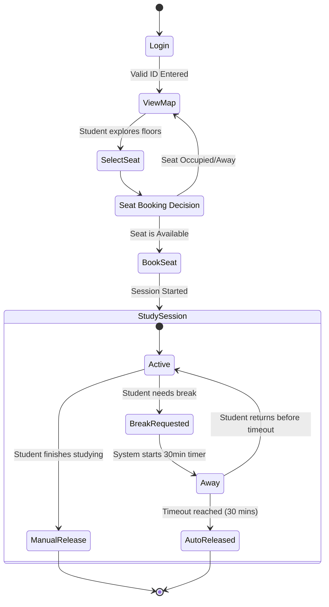

# Activity Diagram

```mermaid
stateDiagram-v2
    [*] --> Login
    Login --> ViewMap: Valid ID Entered
    ViewMap --> SelectSeat: Student explores floors
    
    state "Seat Booking Decision" as Booking
    SelectSeat --> Booking
    Booking --> BookSeat: Seat is Available
    Booking --> ViewMap: Seat Occupied/Away
    
    BookSeat --> StudySession: Session Started
    
    state StudySession {
        [*] --> Active
        Active --> BreakRequested: Student needs break
        BreakRequested --> Away: System starts 30min timer
        Away --> Active: Student returns before timeout
        Away --> AutoReleased: Timeout reached (30 mins)
        Active --> ManualRelease: Student finishes studying
    }
    
    ManualRelease --> [*]
    AutoReleased --> [*]
```
