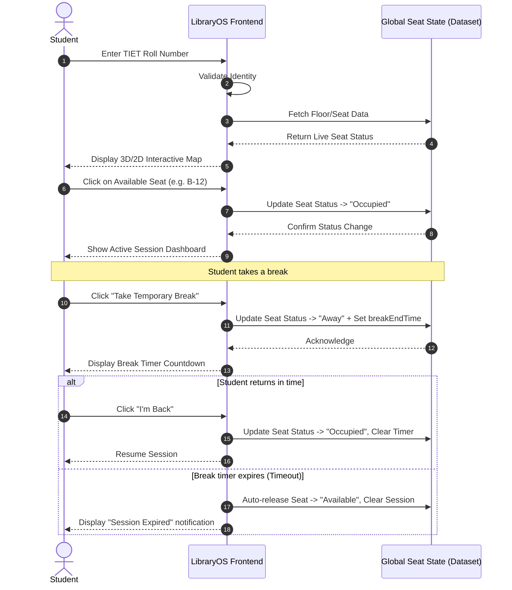

# Sequence Diagram

```mermaid
sequenceDiagram
    autonumber
    actor S as Student
    participant UI as LibraryOS Frontend
    participant DB as Global Seat State (Dataset)
    
    S->>UI: Enter TIET Roll Number
    UI->>UI: Validate Identity
    UI->>DB: Fetch Floor/Seat Data
    DB-->>UI: Return Live Seat Status
    UI-->>S: Display 3D/2D Interactive Map
    
    S->>UI: Click on Available Seat (e.g. B-12)
    UI->>DB: Update Seat Status -> "Occupied"
    DB-->>UI: Confirm Status Change
    UI-->>S: Show Active Session Dashboard
    
    note over S, DB: Student takes a break
    S->>UI: Click "Take Temporary Break"
    UI->>DB: Update Seat Status -> "Away" + Set breakEndTime
    DB-->>UI: Acknowledge
    UI-->>S: Display Break Timer Countdown
    
    alt Student returns in time
        S->>UI: Click "I'm Back"
        UI->>DB: Update Seat Status -> "Occupied", Clear Timer
        UI-->>S: Resume Session
    else Break timer expires (Timeout)
        UI->>DB: Auto-release Seat -> "Available", Clear Session
        UI-->>S: Display "Session Expired" notification
    end
```
