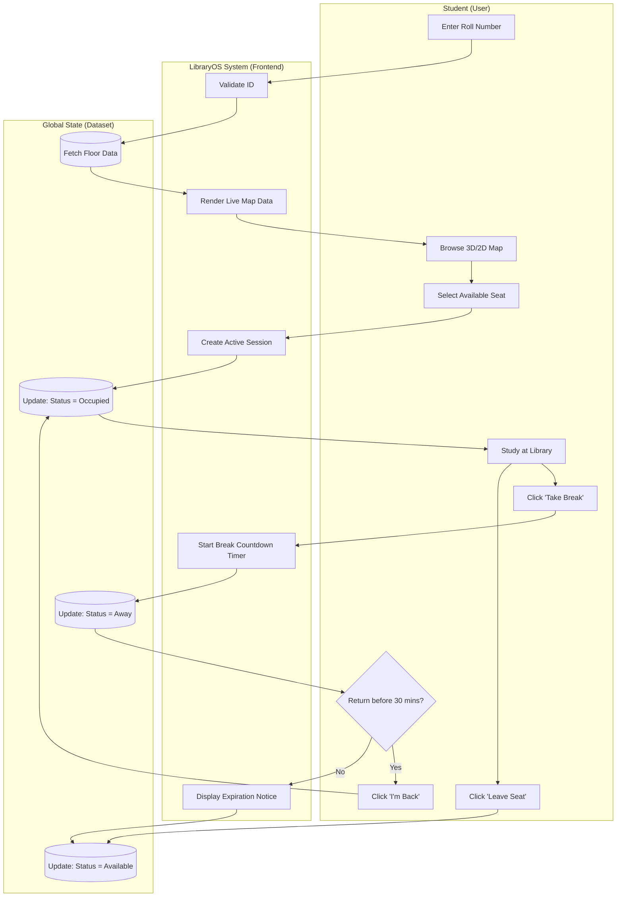

# Swimlane (Cross-Functional) Diagram

```mermaid
flowchart TD
    subgraph Student ["Student (User)"]
        direction TB
        A[Enter Roll Number]
        B[Browse 3D/2D Map]
        C[Select Available Seat]
        D[Study at Library]
        E[Click 'Take Break']
        F{Return before 30 mins?}
        G[Click 'I'm Back']
        H[Click 'Leave Seat']
    end
    
    subgraph Frontend ["LibraryOS System (Frontend)"]
        direction TB
        S1[Validate ID]
        S2[Render Live Map Data]
        S3[Create Active Session]
        S4[Start Break Countdown Timer]
        S5[Display Expiration Notice]
    end
    
    subgraph Database ["Global State (Dataset)"]
        direction TB
        D1[(Fetch Floor Data)]
        D2[(Update: Status = Occupied)]
        D3[(Update: Status = Away)]
        D4[(Update: Status = Available)]
    end

    %% Flow connections
    A --> S1
    S1 --> D1
    D1 --> S2
    S2 --> B
    B --> C
    C --> S3
    S3 --> D2
    D2 --> D
    
    D --> E
    E --> S4
    S4 --> D3
    D3 --> F
    
    F -- Yes --> G
    G --> D2
    
    F -- No --> S5
    S5 --> D4
    
    D --> H
    H --> D4
```
