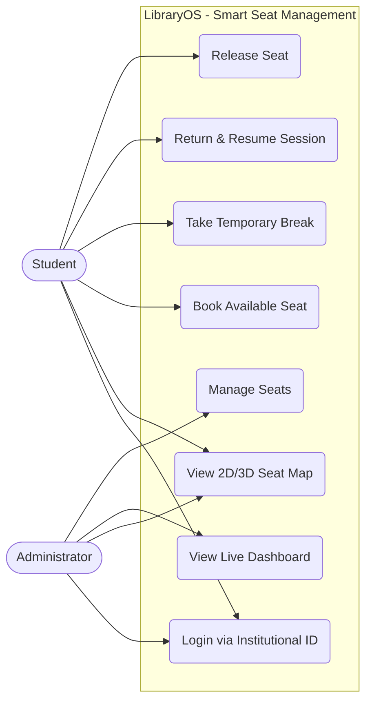

# Use Case Diagram

```mermaid
flowchart LR
    %% Actors
    Student([Student])
    Admin([Administrator])
    
    %% System Boundary
    subgraph LibraryOS [LibraryOS - Smart Seat Management]
        direction TB
        UC1(Login via Institutional ID)
        UC2(View 2D/3D Seat Map)
        UC3(Book Available Seat)
        UC4(Take Temporary Break)
        UC5(Return & Resume Session)
        UC6(Release Seat)
        UC7(View Live Dashboard)
        UC8(Manage Seats)
    end
    
    %% Relationships
    Student --> UC1
    Student --> UC2
    Student --> UC3
    Student --> UC4
    Student --> UC5
    Student --> UC6
    
    Admin --> UC1
    Admin --> UC2
    Admin --> UC7
    Admin --> UC8
```
